# DKST macOS Notary Tool

## ⚠️ Warning: This app is in alpha testing. Please be aware that it may not function as intended.

## Introduction

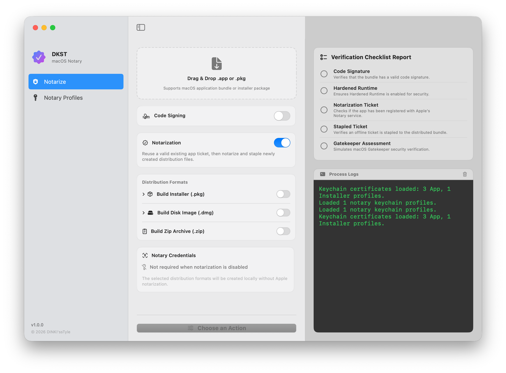  

This tool allows you to easily sign and notarize your macOS app bundles with an Apple registered developer account, as well as diagnose issues. It also supports packaging into PKG, DMG, and ZIP files, assisting with customization for distribution, especially for PKG and DMG.

## Prerequisites
- You need a developer account with an active membership to obtain developer signatures and notarization.
- Xcode and Xcode CLI tools must be installed in the app execution environment.
- For the app to be correctly signed and notarized, you must have usable certificates installed in the execution environment's Keychain. The required certificates are:
  - `Developer ID Applications`: Used for signing apps in distribution environments outside of the App Store.
  - `Developer ID Installer`: Used for signing PKG installation packages.

## Preparing for Signing and Notarization

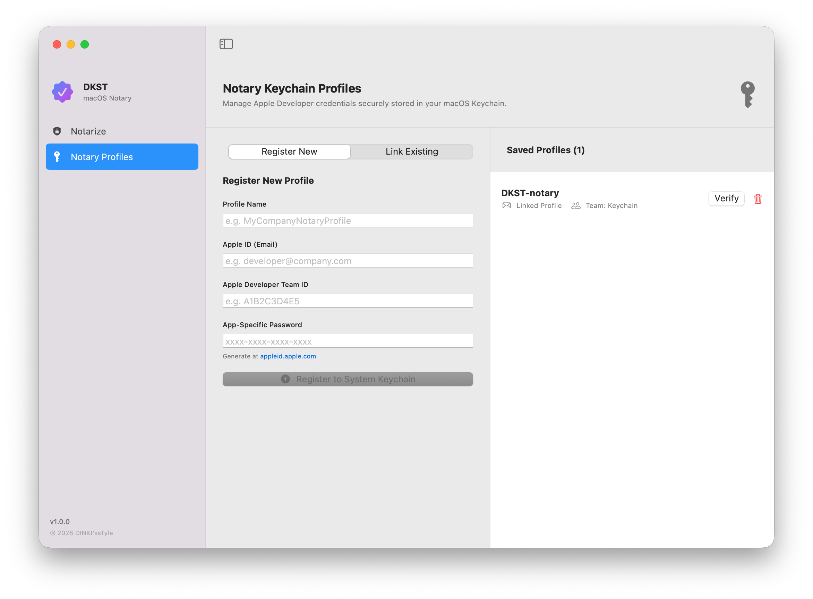  

To begin signing and notarization, you must have a notarization profile installed in the execution environment.
You can check the profiles installed on macOS in the `Notary Profiles` tab and either `Link Existing` or `Register New Profile`.

### Register New Profile
- **Profile Name**: Set the name for your profile. Any name, such as your project or team name, is acceptable.
- **Apple ID (Email)**: Enter the Apple ID with an active Apple Developer Membership.
- **Apple Developer Team ID**: This is a unique ID assigned to each account. You can find it in your Xcode account.
- **App-Specific Password**: Enter the App-Specific Password generated at https://account.apple.com. Caution: This is not your Apple ID login password.

Click the `Register to System Keychain` button to save the information in the macOS Keychain.

### Link Existing Profile
- Profile Name: Enter the name of the profile saved on macOS.
- Clicking `Link Profile to App` will display it in 'Saved Profiles' on the right.
  - Being in `Saved Profiles` does not mean the profile is correct; it simply means it is saved.

## Starting Signing and Notarization

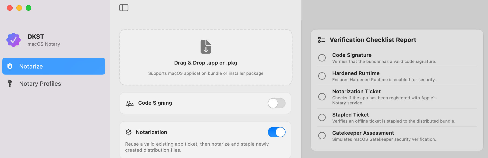  

1. Start from the `Notarize` screen via Drag & Drop.
1. Drag and drop the app bundle or .pkg file to be signed, notarized, or verified.

If you Drag & Drop a signed app bundle, it will indicate that it is already signed. Using 'Verify Only' allows you to check the signing and notarization status, though you can also sign or notarize it again.

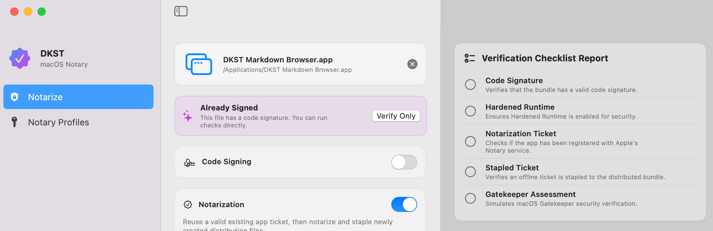  

- **Code Signing**: Turn this on and sign with the selected `Developer ID Applications` certificate.
- **Notarization**: This performs the final notarization after signing.
- **Notary Credentials**: Select the `Notary Profiles` to be used for notarization.

After clicking the `Sign & Notarize` button, please wait until signing and notarization are complete. Once the operation is finished, the signing and notarization verification status will be displayed in the `Verification Checklist Report` on the right.

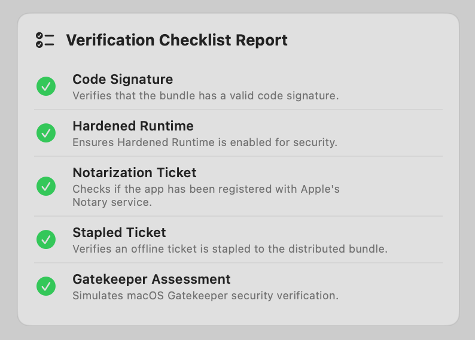  

And there you have it—the app bundle is signed and notarized.

## Distributing with PKG Installation
You can customize a PKG quickly and easily using DKST macOS Notary Tool.

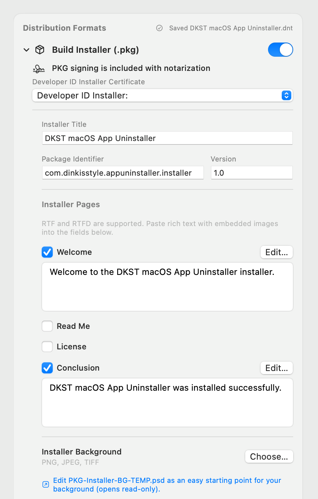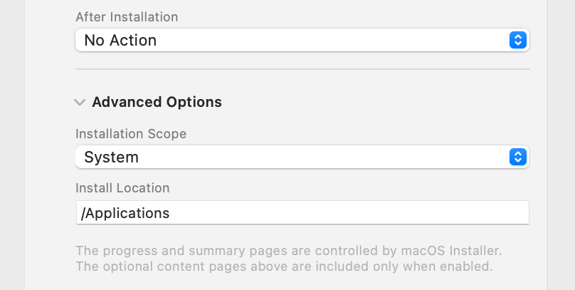  

1. Turn on **Build Installer (.pkg)**.
2. Select the `Developer ID Installer` certificate.  
   Even if the app is already notarized and unchanged, you must notarize the .pkg again for each regeneration.
3. **Installer Title**: Enter the title bar name to be used in the installer. It automatically inserts the app bundle contents, but you can change it if desired.
4. **Package Identifier**: Automatically inserts the app bundle contents. Change as needed.
5. **Installer Pages**: Select and modify the screens displayed at each stage of the installer.
    1. Welcome: This is the first screen users see when running the installer.
       
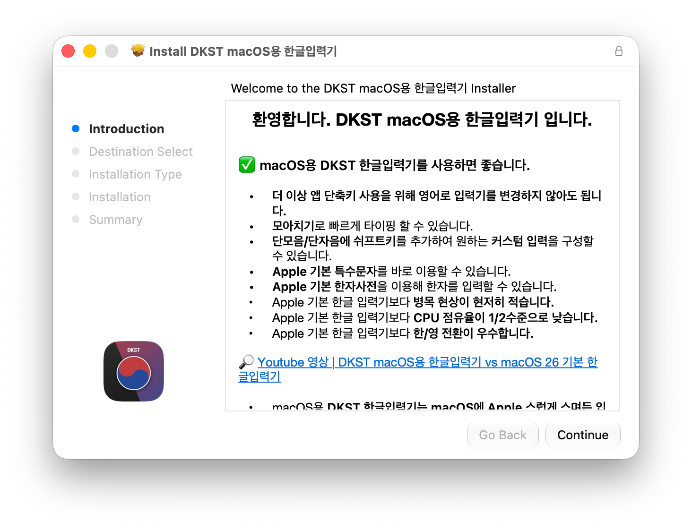 

    1. Read Me: This is the content that should be read.
    1. License: Add this to obtain agreement on the license you are disclosing.
    1. Conclusion: This is the final screen after the installer installation is complete.
    1. Each screen can be edited by pressing the `Edit` button.
    1. The `Edit` screen is an editor that supports Rich Text Format Directory (.rtfd). You can paste formatted text and images. The easiest way to create and edit an .rtfd document is by using macOS's TextEdit.app. Decorate the document, copy it, and paste it into the `Edit` screen.
6. **Installer Background**: The .pkg installer supports a background image. Click `Edit PKG-Installer-BG-TEMP.psd in this project.` to open the Photoshop (.PSD) template stored inside the `.dnt` project. Save your edits to the PSD and it will be converted to PNG automatically during the build. You can still import a separate image with `Choose...`.
7. **After Installation**: This is the type of button displayed to the user when the installer installation is complete.
    1. No Action: This is the most common type. The user can finish the installation and close the installer with a close button.
    1. Require Logout: Upon completion of the installation, the only button provided to the user is the logout button. Unless the installer is forcibly closed, the user must log out.
    1. Require Restart: Upon completion of the installation, the only button provided to the user is the reboot button. Unless the installer is forcibly closed, the user must restart.
8. **Advanced Options**: This option is useful if the app bundle's installation location is not `/Applications`. For example, input method editors fall into this category. Install the app bundle in the `Install Location` specified by the System or user account.

## Distributing with DMG
You can customize a DMG disk quickly and easily using DKST macOS Notary Tool.

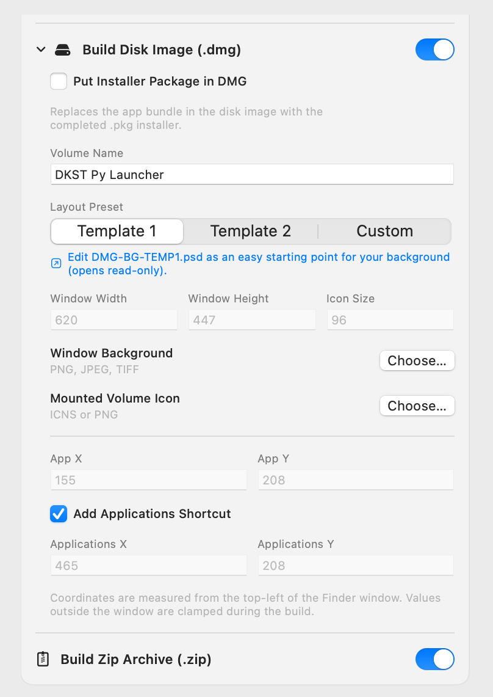  

1. Turn on **Build Disk Image (.dmg)**.
2. Checking **Put Installer Package in DMG** allows you to use the previously created .PKG file as the content of the .DMG disk.
3. **Volume Name**: This is the name of the mounted DMG disk volume. You can modify it as desired.
4. **Layout Preset**: You can choose from two presets or a manual layout.
    1. **Template 1**: Layout with the app icon on the left and the Applications folder on the right.
    1. **Template 2**: Layout with the app icon at the top and the Applications folder at the bottom.
       
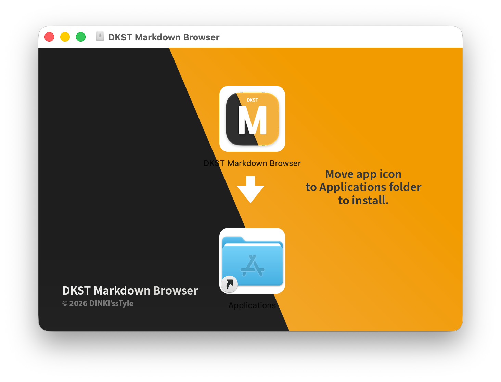 

    1. When selecting a template, a prompt such as `Edit DMG-BG-TEMP.psd in this project.` opens the background PSD stored inside the `.dnt` project. Save your edits to the PSD and it will be converted to PNG automatically during the build.
    1. If you did not select `Put Installer Package in DMG` or `Add Applications Shortcut`, a separate layout with the app or .PKG icon in the center will be selected. You can also open a Photoshop (.PSD) file helpful for background editing in this case.
       
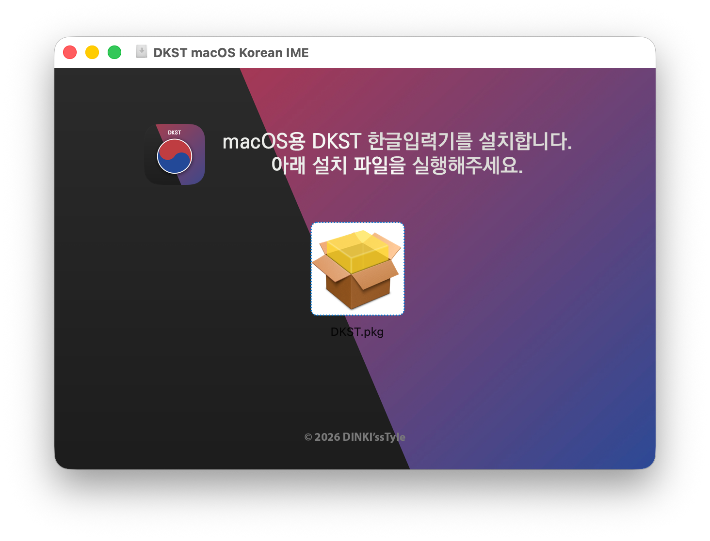 

5. **Add Applications Shortcut**: Select whether to display the Applications folder.

## Distributing with ZIP
While signing and notarization are unlikely to be corrupted during compression, Apple recommends compressing using ditto to prevent any potential damage.

When **Build Zip Archive (.zip)** is enabled, the app bundle is compressed into a .ZIP file using ditto.

## About Auto-Save and Loading
DKST macOS Notary Tool automatically creates a `.DNT` project package in the loaded app bundle folder. Finder presents it as one document, while its project settings, editable PSD templates, and assets are stored in an internal folder structure.

#### Contents of This File
- The name of the working app bundles
- Status of various option selections
- .RTFD content of .PKG pages
- .PKG background image
- .DMG background image, etc.
- Four editable Photoshop (.PSD) templates
- Overall working information

Since this file saves the app bundle's location using a relative path based on your user home folder, you can keep the `.DNT` file anywhere. If the app bundle is not in the location saved when you open a `.DNT` file, a file selection window will appear. If you select a new app bundle, that location is saved in the current `.DNT` file, and if you cancel the selection, it returns to the initial screen without selecting an app bundle. Do not copy the `.DNT` file next to the app bundle.

## Support and Sponsorship

  
    If you want this project to continue without worrying about your wife noticing! Please click the button above!

 

   
This README.md file was written in DKST Markdown. If you are interested in a markdown editor assisted by AI, please click the badge.  

